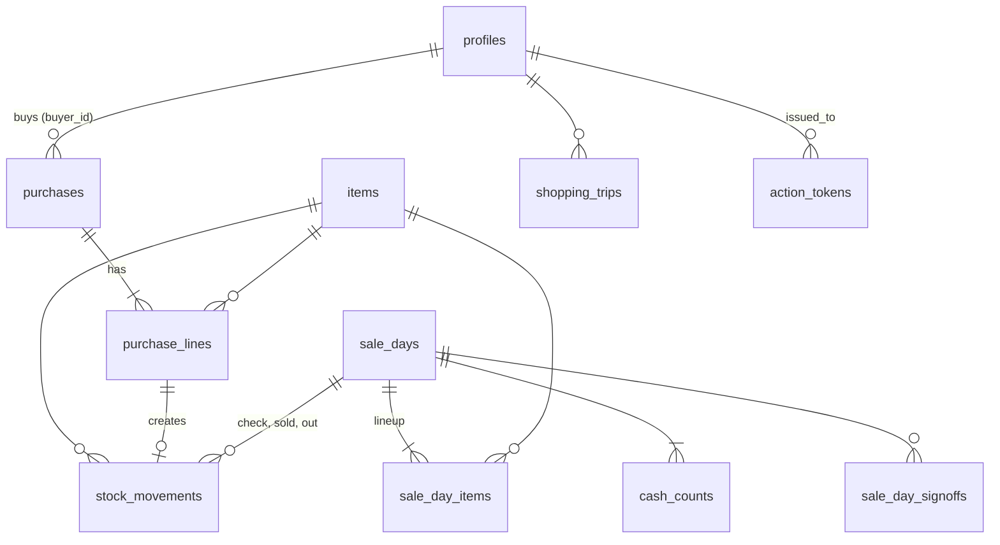

# Data model

The schema is in [`supabase/migrations/`](../supabase/migrations/). It is a **reviewed draft**: it applies cleanly and passes [`supabase/tests/sale_day_flow.test.sql`](../supabase/tests/sale_day_flow.test.sql) (40 checks covering buying, the full sale day, cash maths, sign-off, locks, the ledger and treasurer links). That was checked on plain Postgres 16 with small stand-ins for Supabase's `auth`, `storage` and roles. Run `supabase test db` on the real stack as the first build step.

Conventions:
- **Money:** integer **cents** (`*_cents int`). Unit cost is fractional cents: `unit_cost_cents numeric(10,2)` (13.84 = 13.84¢).
- **Stock:** integer **pieces**, even for deal items.
- **IDs:** `uuid`. Clients may generate them so offline retries don't duplicate.
- **Who/when:** `created_by`, `updated_by` default to `public.actor()`, which is the signed-in user, or the treasurer when an Edge Function redeems a signed link.
- Business maths lives in **views and functions**. The frontend reads views and calls functions; it doesn't compute money.

After writing a migration, run `pnpm db:reset` (or `pnpm db:sync` against an already-running stack) and commit the regenerated [`src/lib/database.types.ts`](../src/lib/database.types.ts) and [`supabase/schema.sql`](../supabase/schema.sql) alongside the migration. TypeScript types for anything in the database come from that generated file — never hand-written. CI's `db` job regenerates both and fails the build if they differ from what's committed.

## Overview

## Tables

| Table | Purpose | Key columns / rules |
|---|---|---|
| `settings` | One row of app settings (admin) | `float_cents` 3000, `target_sale_days` 2, `over_short_ok_cents` 300, `over_short_warn_cents` 1000, `gst_rate` 0.05, `max_items_per_kid` 3, `max_treats_per_kid` 1, `treasurer_email` |
| `profiles` | One per signed-in person | `email`, `display_name`, `role` (volunteer / treasurer / admin), `active`. Volunteers are deactivated, never deleted. |
| `volunteer_invites` | Someone the coordinator added who has not signed in yet | `email` (one open invite each), `display_name`, `role`, `accepted_at`. Admin only. See ADR-0011. |
| `items` | What we sell | `name`, `type` (snack / treat), `storage` (shelf / freezer), `price_cents` (null = needs a price), `bundle_size` (pieces per deal), `unit_cost_cents` (weighted average), `archived`, `version`. Price options limited by a check constraint to $1 × 1/2/3 and $2 × 1. |
| `purchases` | A receipt = a reimbursement claim | `claim_no` (SS-001…), `purchased_on`, `store`, `buyer_id`, `receipt_path`, `status` (to_pay / paid), `paid_at`, `paid_by`, `payment_ref` |
| `purchase_lines` | Receipt lines | `item_id`, `pieces`, `cost_cents` (incl. tax) |
| `stock_movements` | **Append-only stock ledger** | `item_id`, `qty` (±), `reason` (purchase, sold, out, missing, damaged, found, donated, correction; sign enforced), links to `purchase_line_id` or `sale_day_id` |
| `sale_days` | One after-lunch sale | `sale_date`, `phase` (lineup → selling → counting → closed), `float_cents` (copied from settings), `helper_credits`, `note`, timestamps. **Only one open at a time.** |
| `sale_day_items` | The lineup, and every count for it | `check_count`, `check_reason` (lineup phase); `start_count`, `locked_price_cents`, `locked_bundle_size`, `locked_type` (set by `start_sale`); `left_count`, `out_count` (counting phase) |
| `cash_counts` | Cash by denomination | `denom_cents` (2000, 1000, 500, 200, 100, 25, 10, 5), `qty` |
| `sale_day_signoffs` | Sign-off | one row per (sale day, user) |
| `shopping_trips` | "I'm going shopping" | `volunteer_id`, `planned_for` (free text), `released_at`. Only one open trip. |
| `action_tokens` | One-time signed links in the treasurer email | `token_hash` (sha256; plaintext never stored), `purpose` = mark_paid, `payload`, `issued_to`, `expires_at`, `used_at`. No client access. |
| `audit_log` | Change history | `table_name`, `row_pk`, `action`, `old_data`, `new_data`, `actor`, `at`. Filled by the `audit_row()` trigger on every important table. |

Storage: private bucket **`receipts`** (second migration). Members can read and upload.

Local development data lives in [`supabase/seed.sql`](../supabase/seed.sql) and loads on `supabase db reset`: the prototype's team, its five receipts and one finished sale day, all put in through the real functions so stock, weighted-average costs, claim numbers and the sale day maths come out the way they would in production. The seeded claims have a `receipt_path` but no uploaded photo, so their receipt links do not open. The pgTAP tests clear the seed inside their transaction and start from an empty database.

## Views

All views use `security_invoker = true`, so row level security still applies.

| View | Gives you |
|---|---|
| `item_stock` | Every item column plus `on_hand` (sum of the ledger) |
| `item_overview` | What the Items tab reads: `item_stock` plus `days_out`, `is_new` (never in a finished lineup), `pieces_per_day_out`, who bought it last, and who edited it last (for the conflict prompt) |
| `claims` | Purchases plus `claim_label` (SS-001), `total_cents`, `buyer_name` |
| `sale_day_item_results` | Per lineup item: `sold_pieces = start − left − out`, `sales_cents = round(sold × locked price ÷ locked bundle)` |
| `sale_day_totals` | Per sale day: `pieces_sold`, `treat_pieces_sold`, `sales_cents`, `expected_cents = float + sales − helper credits × 100`, `counted_cents`, `over_short_cents`, `deposit_cents = counted − float`, `signoffs`, `items_over_start`, `items_uncounted` |
| `type_benchmarks` | Per type: what a piece usually costs and how fast one item of that type sells, for Deal check (HANDOFF §5.4) |
| `stock_by_type` | Per type: pieces on hand, pieces sold on an average sale day, target stock, "buy about N" and sale days left |
| `lineup_options` | Every item a lineup may hold (priced, active, stock > 0) with its reason tag and whether the app suggests it |
| `sale_day_lineup` | Per lineup item: today's price, deal size and type (locked once the sale starts), the pieces Check stock expects, the counts entered, and the pieces-a-day rate behind the lineup margin |
| `sale_day_lineup_totals` | Per sale day: `day_no`, date, phase, float, `snacks`, `treats`, `items_off` and the weighted lineup `margin` |
| `item_sale_stats` | Per item across closed sale days: `days_out`, `pieces_sold`, `pieces_per_day_out`, `sales_since_out` (0 = out at the last sale, null = never), `sold_out_recently` (closed at 0 in the last 2), `sold_out_days` |
| `change_history` | One row per changed field, read from `audit_log`, for the history lists: item edits (`name`, `price` as `cents/bundle`, `type`, `storage`, `archived`), sale day counts (`check_count`, `left_count`) and `phase`. Skips unit cost, version bumps, an item's first pricing in `log_purchase`, and `begin_count`'s automatic fill |

## Functions (the only way to do the important things)

All are `security definer`, check that the caller is an active member, and keep business rules in one place.

| Function | What it does | Guards |
|---|---|---|
| `add_volunteer(email, name, role)` | Writes the profile if that email already has an account, otherwise an invite. Returns `{"status": "added" \| "invited"}` | Admin only |
| `suggest_lineup()` | Scores items (HANDOFF §5.6); returns `item_id, type, score, reason, suggested` | Priced, active, stock > 0 |
| `create_sale_day(date)` | Creates the sale day with the float from settings and the suggested lineup | One open sale day |
| `start_sale(sale_day, float_cents?)` | Sets the day's float when given (≥ 0; null keeps it). Records Check stock differences as missing / damaged / found movements, sets `start_count`, **locks price, bundle and type**, phase → selling | Only from lineup; every item priced; ≥ 1 item |
| `begin_count(sale_day)` | Phase → counting; pre-fills `left_count = start_count`; creates the eight cash rows | Only from selling |
| `sign_off(sale_day)` | Adds the caller's sign-off | Only while counting; same person twice counts once |
| `close_sale_day(sale_day)` | Posts `sold` and `out` movements, phase → closed | Counting; **1 sign-off**; no item above its start; every item counted; guarded update so a double tap fails cleanly |
| `log_purchase(jsonb)` | One transaction: claim, new items, lines, purchase movements, weighted-average cost, optional price | Idempotent on the purchase `id`; receipt required; ≥ 1 line |
| `issue_mark_paid_tokens(interval)` | For the weekly email: one token per volunteer owed money, issued to the treasurer | Service role only |
| `redeem_action_token(token, ref)` | Marks that volunteer's claims paid, recorded as the treasurer | Service role only; single use; expires |

The `log_purchase` payload shape is documented in the migration above the function.

## Guards (triggers)

- **Phase rules** on `sale_days`, `sale_day_items` and `cash_counts`: lineup rows only change during lineup; Check stock only during lineup; leftover counts and cash only during counting; locked columns only via `start_sale`; **nothing once closed**. Functions bypass this by setting `snack.fn = on` for their own transaction.
- **Sign-offs reset** when any count, cash row or helper credit changes, so the confirmation is always of the final numbers.
- **Ledger is append-only**: update and delete raise an error, even for the service role. Fix mistakes with a `correction` movement.
- **Sign-in** (`on_auth_user_created` on `auth.users`): the first account on an empty database becomes the coordinator; otherwise an open invite for that email becomes a profile. No invite means no profile, and the app says "Ask the coordinator to add you". See ADR-0011.
- **The team keeps a coordinator**: you cannot deactivate yourself, and the last active admin cannot be demoted or deactivated.
- **Items**: `updated_at/by` stamped and `version` bumped on every update. Clients do optimistic concurrency with `.update({...}).eq('id', id).eq('version', loadedVersion)`; zero rows updated means someone else changed it, so show the conflict prompt.

## Row level security

| Who | Can |
|---|---|
| Any active member | Read everything except `action_tokens`. Edit items. Add/remove lineup items and enter counts (phase rules apply). Add `donated` and `correction` stock movements. Claim and release their own shopping trip. Call the functions above. |
| Admin | Also add and update `profiles` (no deletes), read and cancel `volunteer_invites`, and edit `settings`. |
| Treasurer | Same as a member if they ever sign in. Payments come through `redeem_action_token` via the Edge Function. |
| Nobody (clients) | Insert purchases, lines or sale days directly, post sold/out/missing movements, or touch `action_tokens`. Those go through functions. |

## Realtime

The `supabase_realtime` publication includes `sale_days`, `sale_day_items`, `cash_counts` and `sale_day_signoffs`. Subscribe on the Sale day screen filtered by `sale_day_id`, and invalidate the matching TanStack Query keys on each change. Use Presence on a channel per sale day for "Yuki is counting cash".

## Weekly treasurer email (Edge Function)

1. Scheduled with Supabase Cron (pg_cron) every Monday 07:00 America/Vancouver.
2. The function (service role) reads `sale_day_totals` for last week, the `claims` view, and calls `issue_mark_paid_tokens()`.
3. It builds the email (see prototype, Buy → Claims) with links such as `https://<app>/pay?t=<token>`, attaches the CSV ledger, and sends through the email provider.
4. `/pay` is a tiny page that posts the token to a second Edge Function, which calls `redeem_action_token(token, ref)` and shows "Yuki's 2 receipts marked paid".
5. Receipt links in the email are short-lived signed URLs from the `receipts` bucket.

## What's deliberately not in the schema

Individual sales, customers, payment methods, barcodes, per-flavour stock, sale/clearance prices, a healthy flag, claim approval. See `docs/adr/`.

## Things to confirm during the build

- `auth.users` inserts in the test file use only `id` and `email`; adjust if the local Supabase version needs more columns.
- In Supabase, `pgcrypto` lives in the `extensions` schema; the functions call `extensions.gen_random_bytes` and `extensions.digest`.
- Whether to add an index on `stock_movements (item_id, created_at)` once there's real data (not needed at this scale).
